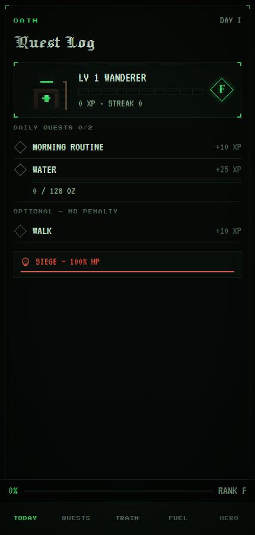
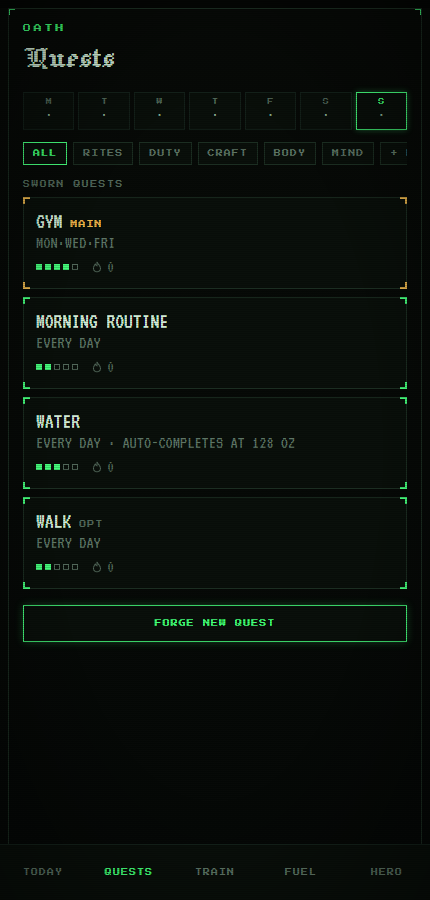
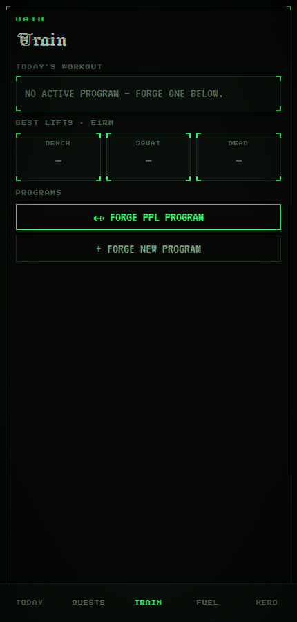
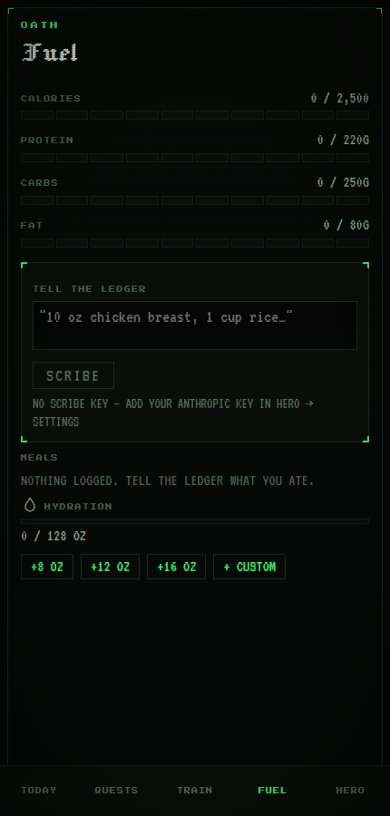
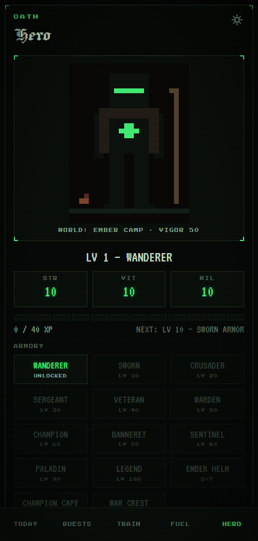

# OATH

A dark retro life-RPG that runs entirely in your browser. Your real days become quest logs: complete daily quests, earn XP, level a pixel knight through 11 armor ages, keep streaks alive with embers, and bring down a weekly siege boss with the weight of your finished work. Fully offline, installable as a PWA, with an optional Claude-powered nutrition scribe.

- **Event-sourced core** — quest completions and XP events are the source of truth; scores, streaks, vigor, and siege state are recomputed caches. Failed quests are recorded, never deleted; consequences never take XP or levels away.
- **Five tabs** — TODAY (quest log + live rank), QUESTS (templates, recurrence, editor), TRAIN (programs, session logger, PRs, e1RM charts), FUEL (macros, hydration, the SCRIBE agent), HERO (knight stage, armory, campaign calendar, deeds, settings).
- **No backend** — everything lives in IndexedDB on your device.

## Screenshots

| Today | Quests | Train | Fuel | Hero |
| --- | --- | --- | --- | --- |
|  |  |  |  |  |

## Run it

```sh
npm i
npm run dev
```

Other scripts: `npm test` (Vitest), `npm run build` (type-check + production build), `npm run preview` (serve the build), `npm run icons` (regenerate PWA icons from `public/icon.svg`).

## Install to home screen

Oath is a PWA — install it for a standalone, fullscreen experience:

- **iOS Safari:** open the app, tap the Share button, then **Add to Home Screen**.
- **Android Chrome:** tap the ⋮ menu, then **Install app** (or accept the install banner).
- **Desktop Chrome/Edge:** click the install icon in the address bar.

## SCRIBE — the Claude nutrition agent

The FUEL tab can turn plain speech ("two eggs and a bagel with cream cheese") into macro estimates using Claude. It needs an Anthropic API key:

1. Get a key at [console.anthropic.com](https://console.anthropic.com).
2. In Oath: **HERO → gear icon (Settings) → Anthropic API key**.

The key is stored only in your browser's IndexedDB and calls go directly from your browser to the Anthropic API. Without a key, meals you log are kept as `needs review` so you can enter macros by hand. Your corrections teach SCRIBE — the last 20 corrections are sent as known values on future estimates, and repeated utterances are served from a local cache without a network call.

## Offline behavior

- The service worker (vite-plugin-pwa, auto-update) caches the whole app; every feature except SCRIBE estimation works with no connection.
- Meal utterances logged offline enter a queue and are estimated automatically when you come back online.
- Days are generated and sealed locally at midnight (or on next open); nothing requires a server.

## Data export / import

**HERO → Settings → DANGER** offers a full JSON backup: export serializes every table (quests, completions, XP events, scores, sessions, meals, settings, …) to a downloadable file; import replaces the current database with a backup. This is the only sync mechanism — cloud sync is intentionally out of scope for the web build.

## Known web limitations

- **Background notifications:** web apps (especially on iOS) cannot fire scheduled local notifications while closed. Oath schedules reminders with in-app timers and best-effort `Notification`s while the app is open; quiet hours (22:00–08:00) and a 4/day cap apply.
- **No vibration on iOS:** haptics use `navigator.vibrate`, which iOS Safari does not support.
- **Storage:** data lives in IndexedDB; clearing site data erases your campaign — export a backup first.
